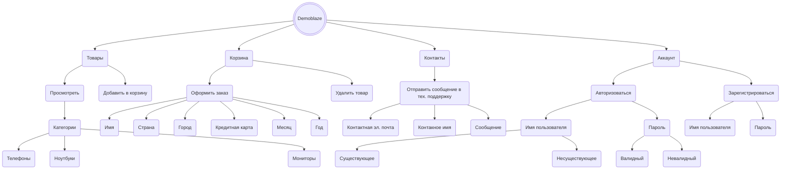
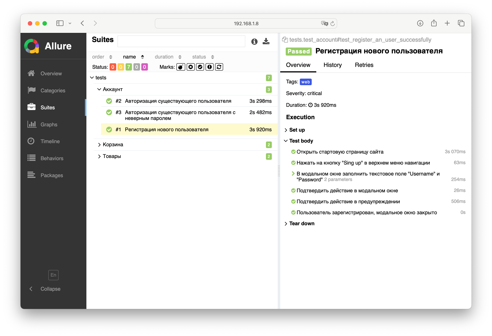
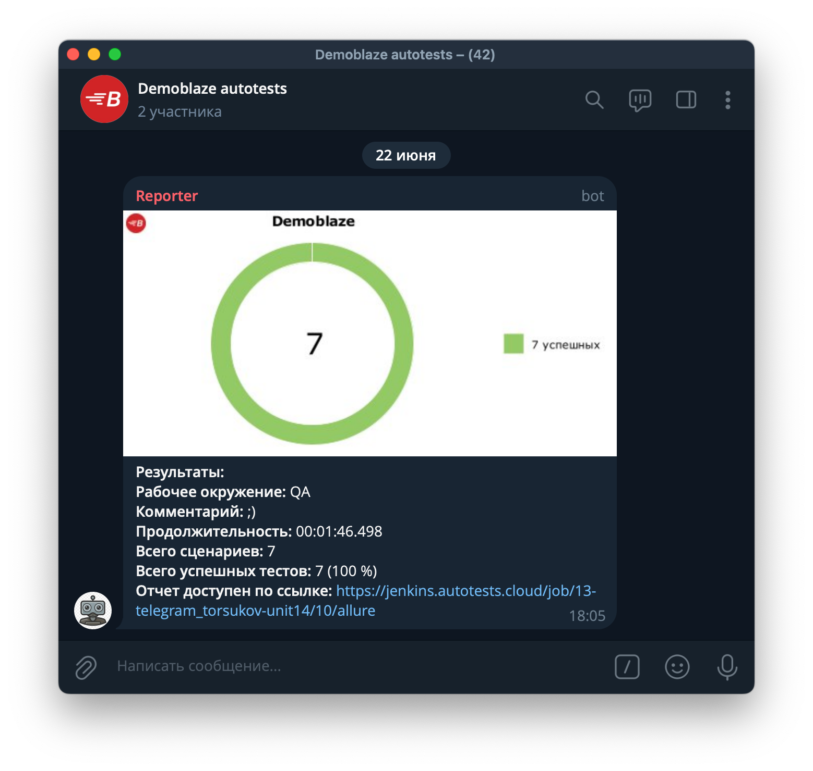
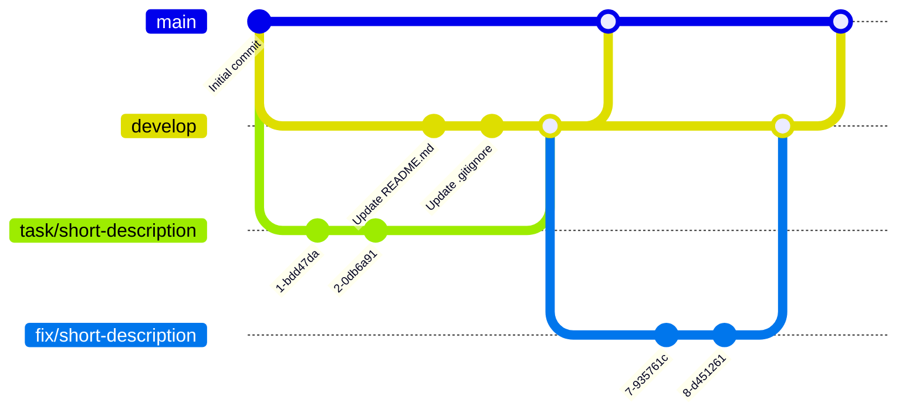

<p align="center">
  <a href="https://www.medusajs.com">
  <picture>

    </picture>
  </a>
</p>
<h1 align="center">
  Demoblaze tests
</h1>

<p align="center">
Тест-кейсы для веб-приложения по онлайн-покупке электроники
</p>
<p align="center">
  <a href="https://python-poetry.org">
    
  </a>
  <a href="https://github.com/psf/black">
    
  </a>
</p>

## Карта функциональных возможностей



## Используемые инструменты
 


 
 

 
 
 
 

## Запуск

<details><summary>Локально</summary>

<br>1. Склонировать репозиторий:

```
git clone https://github.com/lrayne/demoblaze-tests.git
```

2. Установить зависимости:

```
poetry install
```

3. Создать `.env` в корне проекта *(см. `.env.example`)*, внутри него указать:

- **LOGIN** и **PASSWORD** — данные от аккаунта существующего пользователя на [Demoblaze](https://www.demoblaze.com) *(используются в тест-кейсе авторизации)*
- **NAME**, **COUNTRY**, **CITY**, **CREDIT_CARD**, **MONTH**, **YEAR** — данные, необходимые для оформления заказа

4. Запустить тесты:

```
pytest . --mode=local
```
</details>

<details><summary>Удалённо</summary>

<br>1. Склонировать репозиторий:

```
git clone https://github.com/lrayne/demoblaze-tests.git
```

2. Установить зависимости:

```
poetry install
```

3. Создать `.env` в корне проекта *(см. `.env.example`)*, внутри него указать:

- **LOGIN** и **PASSWORD** — данные от аккаунта существующего пользователя на [Demoblaze](https://www.demoblaze.com) *(используются в тест-кейсе авторизации)*
- **NAME**, **COUNTRY**, **CITY**, **CREDIT_CARD**, **MONTH**, **YEAR** — данные, необходимые для оформления заказа
- **SELENOID_LOGIN**, **SELENOID_PASS**, **SELENOID_URL** — учетные данные и URL для удаленного запуска

4. Запустить тесты:
```
pytest . --mode=remote
```

</details>

## Отчёты

<details><summary>Локально</summary>
<br>

```
allure serve allure-results/
```

В результате:




</details>

<details><summary>Удалённо</summary>

<br>Идентичный отчёт можно посмотреть в Jenkins:


</details>

Если тест-кейсы запускались через Jenkins, то в чат telegram'а придёт письмо с результатами:



А в Allure report'е можно будет посмотреть видео прохождения тест-кейсов:


## Ветви проекта



