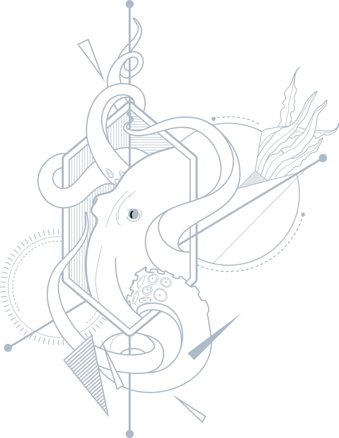
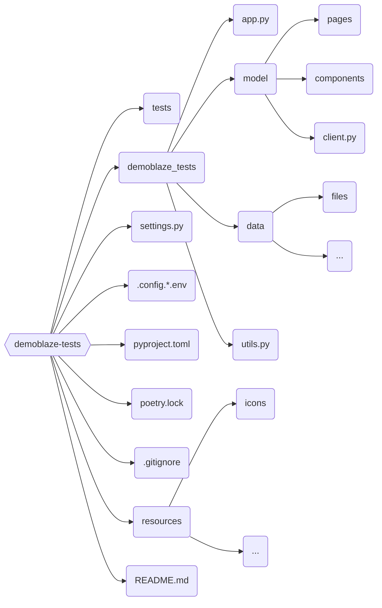

<p align="center">
  <a href="https://demoblaze.com">
  <picture>

    </picture>
  </a>
</p>
<h1 align="center">
  Demoblaze tests
</h1>

<p align="center">
Тест-кейсы для веб-приложения по онлайн-покупке электроники
</p>
<p align="center"> <b><em>
Используемые инструменты:</em></b></p>
<p align="center">
              
</p>

## Структура проекта

<details><summary>Диаграмма</summary>
<br>


</details>

## Запуск

1. Склонировать репозиторий:

```
git clone https://github.com/lrayne/demoblaze-tests.git
```

2. Установить зависимости:

```
poetry install
```
3. Открыть проект в PyCharm, настроить интерпретатор

4. Скопировать содержимое из `config.*.env.example` в `config.*.env`, где `*` — `local` или `remote`
5. Поместить `config.*.env` в корень проекта 
6. При необходимости изменить значения у параметров в `config.*.env`

7. Запустить тест-кейсы, исходя из выбранного контекста:

```
context='local' pytest tests/
```

```
context='remote' pytest tests/
```


##  Jenkins

[](https://jenkins.autotests.cloud/job/demoblaze-tests/)

### Параметры сборки:

- `TEST_SUITE` — тестовый набор
- `DRIVER_NAME` — наименование браузера
- `DRIVER_VERSION` — версия браузера
- `WINDOW_WIDTH` и `WINDOW_HEIGHT` — разрешение окна
- `TIMEOUT` – максимальное время ожидания элемента
- `ENVIRONMENT` — окружение, `COMMENT` — комментарий. Будут отображаться в уведомлении telegram'а


##  Allure TestOps

##   Jira


## Отчёты

<details><summary>При локальном запуске</summary>
<br>

```
allure serve allure-results/
```

В результате:


</details>

<details><summary>При удаленном запуске</summary>

<br>[Отчёт можно посмотреть в Jenkins](https://jenkins.autotests.cloud/job/13-telegram_torsukov-unit14/10/allure/):


<br>Если тест-кейсы запускались [через Jenkins](https://jenkins.autotests.cloud/job/13-telegram_torsukov-unit14/build?delay=0sec), то в чат telegram'а придёт письмо с результатами:


А в [отчёте](https://jenkins.autotests.cloud/job/13-telegram_torsukov-unit14/10/allure/) можно будет посмотреть видео прохождения тест-кейсов:
<br>


</details>


 
