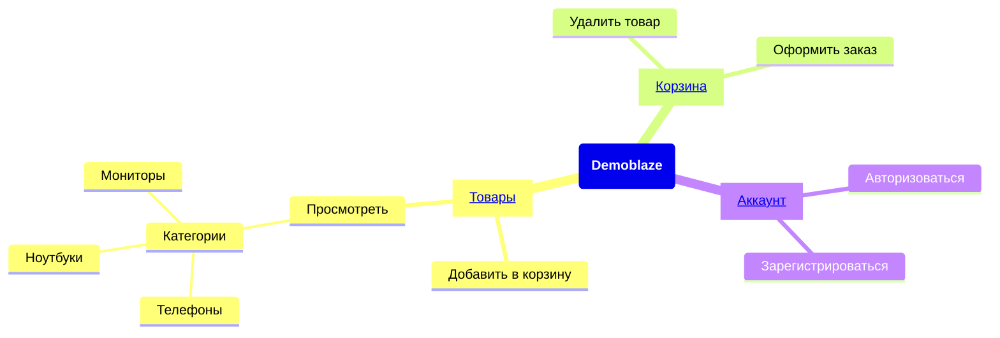

  <a href="https://www.demoblaze.com">
  <picture>
    
    </picture>
  </a>

<h1 align="center">
  Demoblaze ui tests
</h1>

Тест-кейсы для веб-приложения по онлайн-покупке электроники

  
  

## Карта покрытия пользовательских путей

